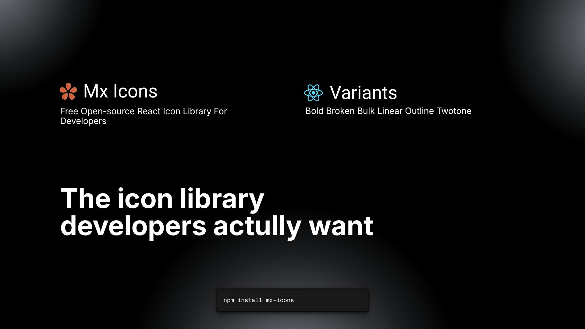

<p align="center">
  <a href="https://mxicons.vercel.app/">
    
  </a>
</p>

<h1 align="center">Mx Icons</h1>

<p align="center">
  <strong>Open source, beautiful icons for React projects. Beautiful SVG components with multiple style variants - linear, bold, bulk, and more. Customizable, and ready for your app or design system.</strong>
</p>

<p align="center">
  <a href="https://mx-icons.vercel.app/">Live Demo</a> •
  <a href="https://mx-icons.vercel.app/">Browse Icons</a> •
  <a href="https://mxicons.vercel.app/installation">Documentation</a> •
  <a href="./CONTRIBUTING.md">Contributing</a>
</p>

<p align="center">
  
  
  
  
</p>

<br/>

---

## ✨ Features

- 🎨 **Multiple Variants** — Every icon comes in outline, solid, and mini (16px) versions
- ⚡ **Lightweight & Fast** — Tree-shakeable, only imports what you use
- 🔧 **Fully Customizable** — Control size, color, and all SVG attributes
- 📦 **Zero Dependencies** — Only React as a peer dependency (18.x or 19.x)
- 💅 **Modern Design** — Clean, professional icons optimized for light-mode interfaces
- 📱 **Responsive** — Built-in support for different sizes (24px standard, 16px mini)

## 📦 Installation

```bash
npm install mx-icons
```

## 🚀 Quick Start

```jsx
import { NoteTextLinear } from "mx-icons";

function App() {
  return (
    <div>
      <NoteTextLinear />
      <NoteTextLinear size={24} color="#292D32" />
    </div>
  );
}
```

## 🎨 Props & Customization

All icon components accept the following props:

| Prop        | Type               | Default     | Description                                 |
| ----------- | ------------------ | ----------- | -------------------------------------------- |
| `size`      | `number \| string` | `24`        | Icon width and height (px or any CSS unit)   |
| `color`     | `string`           | `"#292D32"` | Icon color (any CSS color)                   |
| `className` | `string`           | `""`        | Additional CSS classes                       |

### Run Preview Locally

```bash
# Clone the repository
git clone https://github.com/ig-imanish/mx-icons.git
cd mx-icons

# Install dependencies
npm install

# Start the preview app
npm run dev
```

Open [http://localhost:5173](http://localhost:5173) in your browser.

## 🤝 Contributing

We welcome contributions from developers of all skill levels! Here's how you can help make MX Icons even better.

### Ways to Contribute

- 🐛 **Report Bugs** — Found an issue? [Open a bug report](https://github.com/ig-imanish/mx-icons/issues/new)
- 💡 **Request Icons** — Tell us which icons you need for your projects
- 🎨 **Add New Icons** — Contribute new icons following our design guidelines
- 📖 **Improve Documentation** — Help make our docs clearer and more comprehensive
- 🔧 **Fix Issues** — Browse [open issues](https://github.com/ig-imanish/mx-icons/issues) and submit fixes
- ⭐ **Star the Repo** — Show your support and help us grow!
- 🐦 **Share** — Spread the word about MX Icons

### Quick Start for Contributors

1. **Fork** the repository
2. **Clone** your fork: `git clone https://github.com/YOUR_USERNAME/mx-icons.git`
3. **Install** dependencies: `npm install`
4. **Create** a feature branch: `git checkout -b feature/new-icon`
5. **Make** your changes and test: `npm run dev`
6. **Lint** your code: `npm run lint`
7. **Build** the library: `npm run build:lib`
8. **Commit** with a clear message: `git commit -m "feat(icons): add calendar icon"`
9. **Push** to your fork: `git push origin feature/new-icon`
10. **Submit** a pull request

### Development Setup

```bash
# Clone the repository
git clone https://github.com/ig-imanish/mx-icons.git
cd mx-icons

# Install dependencies
npm install

# Start development server
npm run dev

# Run linter
npm run lint

# Build library
npm run build:lib
```

### Adding a New Icon

Icons should follow these guidelines:

- **Format**: Optimized SVG
- **Size**: 24x24px (standard) or 16x16px (mini)
- **Variants**: Provide Linear, Bold, and Mini versions
- **Color**: Use `currentColor` for easy customization
- **Naming**: PascalCase with variant suffix (e.g., `CalendarLinear`, `CalendarBold`)

Example icon component:

```jsx
import React from "react";
import Icon from "../../Icon";

export const CalendarLinear = (props) => (
  <Icon {...props}>
    <path d="..." fill="none" stroke="currentColor" strokeWidth="1.5" />
  </Icon>
);
```

### Commit Message Format

We follow [Conventional Commits](https://www.conventionalcommits.org/):

```
feat(icons): add calendar icon with all variants
fix(modal): resolve scrollbar display issue
docs(readme): update installation guide
```

### Pull Request Guidelines

- Provide a clear description of your changes
- Include screenshots for visual changes
- Reference related issues (e.g., "Closes #123")
- Ensure all tests pass and linting is clean
- Update documentation if needed

For comprehensive guidelines, check out our [**CONTRIBUTING.md**](https://github.com/ig-imanish/mx-icons/blob/main/CONTRIBUTING.md).

## 📄 License

MIT License © 2025 [MX Icons Contributors](https://github.com/ig-imanish/mx-icons/graphs/contributors)

Free to use in personal and commercial projects. See [LICENSE](./LICENSE) for details.

## 📊 Project Stats

<p>
  
  
  
  
</p>

## 🔗 Links

- **📦 NPM Package:** [npmjs.com/package/mx-icons](https://www.npmjs.com/package/mx-icons)
- **🌐 Live Preview:** [ig-imanish.github.io/mx-icons](https://ig-imanish.github.io/mx-icons)
- **📚 Documentation:** [github.com/ig-imanish/mx-icons](https://github.com/ig-imanish/mx-icons)
- **🐛 Issues:** [github.com/ig-imanish/mx-icons/issues](https://github.com/ig-imanish/mx-icons/issues)
- **💬 Discussions:** [github.com/ig-imanish/mx-icons/discussions](https://github.com/ig-imanish/mx-icons/discussions)


## Stargazers over Time

[](https://starchart.cc/ig-imanish/mx-icons)

<div align="center">
  <strong>Made with ❤️ by the open-source community</strong>
  <br/>
  If you find this project useful, please consider giving it a ⭐ on GitHub!
</div>
